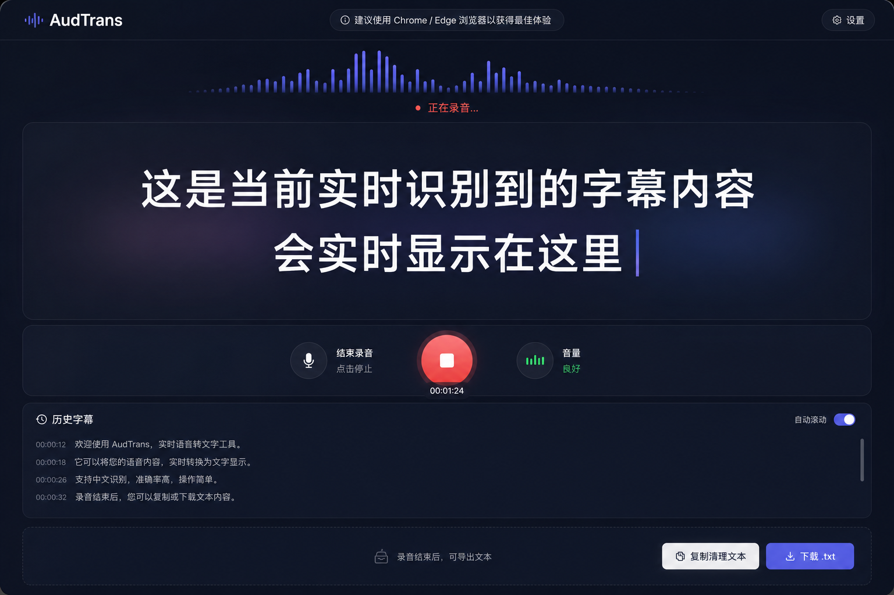

# AudTrans

<p style="margin:4px 0 16px; font-size:14px; color:#777;">
  <strong>Language · 语言：</strong>
  <a href="#en" style="color:#4f8cff; text-decoration:none;">English</a>
  <span style="color:#ccc;"> ｜ </span>
  <a href="#audtrans中文" style="color:#4f8cff; text-decoration:none;">中文</a>
</p>

<!-- English section id="en" (anchor goes above # AudTrans so it stays visible) -->
<a id="en" style="display:block; margin-top:-24px; visibility:hidden;"></a>

> A **web-based live caption tool** inspired by typeless. Open a recording or meeting, get real-time speech captions, with filler words and weak expressions visually marked.

## What it does

- One-click recording in the browser → real-time streaming captions (Chinese first)
- **Filler words** (嗯 / 啊 / 那个…) → **red + strikethrough**
- **Weak expressions** (然后 / 就是…) → **blue + strikethrough** + inline suggestions; tap to accept the replacement
- Session history auto-saved as JSON; export / import / copy cleaned text (auto-remove filler, replace weak expressions)
- Works on both **Windows and Mac** (open in browser)

## Interface prototype



A typeless-style layout: top bar for settings, center streaming captions with inline marks, bottom control bar.

## Quick start

Pure frontend. Zero build. Zero server.

**Option 1: open directly in browser**

```bash
# Double click index.html (desktop Chrome / Edge recommended)
```

**Option 2: run a static server (avoids `file://` limits in some browsers)**

```bash
python3 -m http.server 8000
# then visit http://localhost:8000
```

> ⚠️ **Browser compatibility**: speech recognition relies on the browser's built-in Web Speech API. **Desktop Chrome / Edge have the best Chinese support**. Firefox / Safari / mobile browsers are not yet supported and will get a guidance prompt.

## Usage

1. Open page → click **「开始录音 / Start recording」**
2. Browser asks for microphone permission → allow
3. Start speaking → **live captions appear in the center**, filler / weak expressions marked instantly
4. Tap the **inline suggestion bubble** on a weak expression to accept the replacement
5. Click **「结束录音 / Stop」** → export actions appear: **copy cleaned text** / **download TXT** / **export JSON**
6. History sessions listed on the left; JSON can be imported back to page

## Lexicon

Two built-in Chinese lexicons (`data/filler.json`, `data/weak.json`) — works out of the box.

External URLs are also supported for override:

```
index.html?fillerUrl=https://example.com/filler.json&weakUrl=https://example.com/weak.json
```

Invalid URLs (network / CORS failure) silently fall back to the built-in lexicon — your session is not interrupted.

## Privacy

- Speech recognition uses the **browser's built-in engine** (Web Speech API); recognition is handled by the browser and its default engine.
- **This project does NOT collect, store, or upload any speech or caption data.**
- Session history stays **local to the browser** (localStorage); you can also actively export JSON files to your local disk.

## Development

Want to tinker rather than just use it? See [CONTRIBUTING.md](./CONTRIBUTING.md).

## Roadmap

Current progress, backlog, and recent releases: see [ROADMAP.md](./ROADMAP.md).

Changelog: see [CHANGELOG.md](./CHANGELOG.md).

## License

MIT. See [LICENSE](./LICENSE).

---

<br />

# AudTrans（中文）

<p style="margin:4px 0 16px; font-size:14px; color:#777;">
  <strong>Language · 语言：</strong>
  <a href="#en" style="color:#4f8cff; text-decoration:none;">English</a>
  <span style="color:#ccc;"> ｜ </span>
  <a href="#audtrans中文" style="color:#4f8cff; text-decoration:none;">中文</a>
</p>

> 一个受 typeless 启发的**网页版实时字幕工具**：开录音 / 会议时，实时显示语音字幕，并自动标注语气词与表达不佳的词。

## 能做什么

- 浏览器一键开始录音 → 实时流式字幕（中文优先）
- **语气词**（嗯、啊、那个…）→ **红色 + 删除线**
- **表达不佳词**（然后、就是…）→ **蓝色 + 删除线** + 行内建议，点击即可接受替换
- 历史会话自动保存为 JSON，可导出、导入、复制清理后文本（自动删 filler、替换弱表达）
- **Windows / Mac 通用**（浏览器打开即用）

## 界面原型


参照 typeless 范式：顶部设置、中间实时字幕流带行内标注、底部控制栏。

## 快速开始

纯前端，无构建，零服务端。

**方式一：直接用浏览器打开**

```bash
# 进项目目录双击 index.html（推荐 Chrome / Edge 桌面版）
```

**方式二：起静态服务器（解决部分浏览器对 file:// 的限制）**

```bash
python3 -m http.server 8000
# 访问 http://localhost:8000
```

> ⚠️ **浏览器兼容**：语音识别依赖浏览器内置的 Web Speech API，**桌面 Chrome / Edge 对中文支持最好**。Firefox / Safari / 移动端浏览器暂不支持，页面会给出引导提示。

## 使用流程

1. 打开页面 → 点击「开始录音」
2. 浏览器会请求麦克风权限 → 允许
3. 开始说话 →**实时字幕出现在主区**，语气词 / 弱表达即时标注
4. 点击弱表达的**行内建议气泡**可接受替换
5. 点击「结束录音」 → 出现导出入口：**复制清理文本** / **下载 TXT** / **导出 JSON**
6. 历史会话在左侧面板可浏览，JSON 可导入回页面复现

## 词库

内置两份中文词库（`data/filler.json`、`data/weak.json`），开箱即用。

也支持**外部 URL 覆盖**：

```
index.html?fillerUrl=https://example.com/filler.json&weakUrl=https://example.com/weak.json
```

无效 URL（网络 / CORS 失败）时自动回退内置词库，不影响使用。

## 隐私说明

- 语音识别走**浏览器内置引擎**（Web Speech API），识别过程由浏览器及其默认引擎处理。
- **本项目不采集、不存储、不上传任何语音或字幕数据**。
- 历史会话保留在**浏览器本地**（localStorage），也可主动导出 JSON 文件到本地。

## 开发

不想看成品只想改着玩？见 [CONTRIBUTING.md](./CONTRIBUTING.md)。

## 路线图

当前进度、待办、近期发版，见 [ROADMAP.md](./ROADMAP.md)。

更新日志见 [CHANGELOG.md](./CHANGELOG.md)。

## 开源协议

MIT。见 [LICENSE](./LICENSE)。
